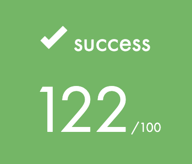

# libft - Your first own library

> <em> The aim of this project is to code a C library regrouping usual functions that you’ll be allowed to use in all your other projects. </em>

## Description 
Have you ever wanted to create plenty of libc functions from scratch - I bet you have. Well here are my version of many of them and even some bonuses. With these functions you will have easier time to creating lot of C language project!

## PDF

 href="./README/pdf/libft.en.pdf"/>

### Keywords
- Library
- libc functions
- Reverse engineering
